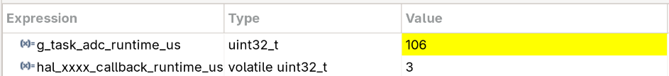

# Actividad 3
## Paso 3: Preguntas a Gemini

Este documento presenta un análisis detallado del funcionamiento del código fuente provisto, el cual constituye una plantilla estructurada para un sistema de tiempo real basado en un enfoque **Event-Triggered (guiado por eventos)** utilizando el kernel **FreeRTOS**.

---

## 1. Arquitectura General del Sistema

El sistema está diseñado para coordinar la adquisición de datos de un periférico ADC e interrupciones de usuario (botones) con tareas de procesamiento en segundo plano. Actualmente, el código se encuentra en un estado base de inicialización ("esqueleto") donde se configuran los controladores, se lanza una tarea testigo de ejecución y se configuran las funciones de diagnóstico (*hooks*) del sistema operativo. El diseño prevé la futura incorporación de colas (*queues*) y semáforos para comunicar de forma asincrónica las interrupciones de hardware con las tareas de FreeRTOS.

---

## 2. Análisis Detallado por Archivo

### 📄 `app.c`
Es el módulo principal de inicialización de la capa de aplicación.
* **`app_init()`**: Inicializa las variables globales de control de ticks (`g_app_tick_cnt`), ociosidad (`g_task_idle_cnt`) y desbordamiento de pila (`g_app_stack_overflow_cnt`).
* **Creación de Tareas**: Utiliza la API `xTaskCreate` para instanciar únicamente la tarea `task_receiver`, asignándole una prioridad baja (`tskIDLE_PRIORITY + 1ul`) y un tamaño de *stack* específico. Aunque se declaran los manejadores (*handles*) para `h_task_sender` y `h_task_receiver`, la tarea de envío no se crea en esta instancia.
* **Inicialización de Periféricos**: Llama a `open_adc(&hadc1)` para preparar el driver del ADC, invoca a `app_it_init()` para configurar las interrupciones de la aplicación y arranca el contador de ciclos de hardware mediante `cycle_counter_init()`.

### 📄 `app_it.c`
Este archivo centraliza las rutinas de servicio de interrupción (ISR) y las funciones de *callback* de la capa de abstracción de hardware (HAL).
* **`app_it_init()`**: Configura el estado inicial de las banderas de interrupción. Protege el acceso a estas variables críticas deshabilitando temporalmente las interrupciones globales con la instrucción ensamblador `CPSID i` y restableciéndolas con `CPSIE i`.
* **`HAL_GPIO_EXTI_Callback()`**: Se ejecuta al detectar un cambio de estado en los pines configurados como interrupción externa. Evalúa específicamente si el evento proviene del botón `BTN_A_PIN`.
* **`HAL_ADC_ConvCpltCallback()`**: Se dispara automáticamente cuando el periférico `ADC1` finaliza una conversión analógica-digital. Pone la bandera `hal_xxxx_callback_flag` en verdadero, incrementa el contador de conversiones `hal_xxxx_callback_cnt` y registra el tiempo exacto del evento en microsegundos usando el contador de ciclos del procesador.

### 📄 `task_receiver.c`
Define el comportamiento de la única tarea actualmente activa en el planificador de FreeRTOS.
* **`task_receiver()`**: Tras mostrar un mensaje inicial de diagnóstico con el tiempo de tick actual, entra en un bucle infinito `for(;;)`.
* **Operación**: En cada ciclo incrementa la variable `g_task_receiver_cnt` y envía un mensaje de texto informativo al *logger*. Posteriormente, libera el procesador de forma voluntaria invocando `vTaskDelay(TASK_RECEIVER_DEL_MAX)`, lo que la coloca en estado bloqueado por un período equivalente a 250 milisegundos.

### 📄 `task_adc.c`
Implementa la lógica destinada al procesamiento de datos del ADC a través de la función `task_adc_rx`. **Nota:** Esta tarea no se encuentra operativa en el sistema final actual ya que no es creada dentro de `app.c`.
* **Operación teórica**: Si estuviera activa, su bucle incrementaría su propio contador (`g_task_xxxx_rx_cnt`), reiniciaría el contador de ciclos, alternaría el estado lógico de un pin de salida (`LED_A_PIN`) mediante `HAL_GPIO_TogglePin`, mediría el tiempo de ejecución en microsegundos y se bloquearía durante 250 ms empleando `vTaskDelay`.

### 📄 `task_adc_interface.c` y `task_adc_interface.h`
Estos archivos definen la interfaz de abstracción del controlador de dispositivo (*device driver*) para el módulo ADC, siguiendo una convención de diseño clásica similar a los sistemas POSIX.
* Contiene los prototipos y las definiciones para las funciones de control: `open_adc`, `release_adc`, `write_adc`, `read_adc` e `ioctl_adc`.
* En el estado actual del desarrollo, todas las implementaciones son funciones vacías (*stubs*) que incluyen la macro `UNUSED(h_adc_device)` para prevenir alertas o *warnings* del compilador por parámetros no utilizados.

### 📄 `freertos.c`
Agrupa las funciones de captura (*hooks* o *callbacks*) internas del kernel de FreeRTOS que permiten monitorear la salud y el rendimiento del sistema.
* **`vApplicationIdleHook()`**: Es invocada repetidamente por la tarea *Idle* del sistema operativo cuando ninguna otra tarea de mayor prioridad puede ejecutarse. Incrementa de forma continua el contador `g_task_idle_cnt`.
* **`vApplicationTickHook()`**: Se ejecuta de forma asincrónica dentro del contexto de la interrupción del reloj del sistema (System Tick). Su función consiste en incrementar el contador global de ticks de la aplicación (`g_app_tick_cnt`).
* **`vApplicationStackOverflowHook()`**: Se activa de manera inmediata si el sistema detecta que una tarea ha excedido el límite de la memoria asignada a su pila (*stack*). Entra en una sección crítica de hardware (`taskENTER_CRITICAL`) y fuerza la detención completa de la ejecución del firmware mediante `configASSERT(0)` con fines de depuración.

---

## 3. Dinámica de Ejecución y Flujo del Sistema

Para garantizar una visualización íntegra en cualquier lector de Markdown (como GitHub, Obsidian, VS Code o Notion) sin riesgos de recortes visuales, a continuación se detalla la arquitectura temporal y el flujo del firmware mediante una estructura lógica y secuencial.

### Flujo Secuencial del Firmware

* **[FASE 1] Inicialización del Sistema (Ejecución Secuencial)**
    * El microcontrolador se enciende o sufre un reinicio físico (*Power On / Reset*).
    * Se ejecuta la función principal `app_init()` en el hilo primario de hardware:
        * Se inicializan a cero los contadores globales de control (`g_app_tick_cnt`, `g_task_idle_cnt`, `g_app_stack_overflow_cnt`).
        * Se registra la tarea de FreeRTOS `task_receiver` con prioridad baja (`prioridad 1`) mediante la API `xTaskCreate()`.
        * Se inicializa la interfaz de abstracción del controlador del ADC llamando a `open_adc(&hadc1)`.
        * Se configuran y habilitan las interrupciones críticas del sistema (`app_it_init()`) usando instrucciones atómicas en ensamblador (`CPSID i` / `CPSIE i`).
        * Se activa el contador de ciclos de hardware del procesador mediante `cycle_counter_init()`.

* **[FASE 2] Lanzamiento del Kernel**
    * El firmware invoca la función `vTaskStartScheduler()`. En este instante, el hilo de inicialización inicial se detiene y el Planificador de FreeRTOS (*Scheduler*) toma el control absoluto de la CPU para gestionar el tiempo real.

* **[FASE 3] Operación por Eventos (Mapeo de Escenarios en Tiempo Real)**
    * Una vez en marcha, el planificador evalúa constantemente el estado del sistema y reacciona de manera inmediata ante cuatro tipos de estímulos o eventos:

    * **Escenario A: Expiración de Temporizador (Cada 250 ms)**
        * *Origen:* Software (Manejador de tiempos del Kernel).
        * *Flujo:* Al cumplirse el tiempo configurado, la tarea `task_receiver` pasa automáticamente de estado *Bloqueado* a estado *Listo*. El planificador detiene tareas menores y le asigna el uso de la CPU.
        * *Acciones:* La tarea incrementa su variable de control (`g_task_receiver_cnt`), envía un mensaje de texto informativo al puerto de diagnóstico (consola) y se vuelve a bloquear voluntariamente por otros 250 ms invocando `vTaskDelay(TASK_RECEIVER_DEL_MAX)`.

    * **Escenario B: Conversión de ADC Completada (Asincrónico)**
        * *Origen:* Hardware (Periférico interno ADC1).
        * *Flujo:* El hardware del ADC termina de procesar una señal analógica y genera una interrupción física. La CPU pausa temporalmente la tarea que esté ejecutando y salta a la rutina de servicio `HAL_ADC_ConvCpltCallback()`.
        * *Acciones:* Se levanta la bandera de estado (`hal_xxxx_callback_flag = true`), se incrementa el contador de muestras del periférico (`hal_xxxx_callback_cnt`) y se almacena la marca de tiempo exacta en microsegundos usando el contador de ciclos de la CPU. Al finalizar la rutina, la CPU devuelve el control al planificador.

    * **Escenario C: CPU Libre (Modo Ocioso o Reposo)**
        * *Origen:* Kernel de FreeRTOS (Cuando ninguna tarea de la aplicación requiere procesamiento).
        * *Flujo:* El planificador detecta que no hay tareas en estado *Listo* y cede el control a la tarea de menor prioridad del sistema (*Idle Task*).
        * *Acciones:* Se invoca de forma repetitiva la función hook `vApplicationIdleHook()`, la cual incrementa continuamente el contador global `g_task_idle_cnt`. Esta métrica es fundamental para calcular de forma indirecta el porcentaje de tiempo libre que le queda al microcontrolador.

    * **Escenario D: Tick del Sistema (Frecuencia Fija)**
        * *Origen:* Hardware (Temporizador de reloj del núcleo / SysTick).
        * *Flujo:* Se genera una interrupción periódica por hardware que le dicta el ritmo al sistema operativo.
        * *Acciones:* Invoca internamente a la función corta `vApplicationTickHook()`, la cual incrementa el contador global de ticks del sistema (`g_app_tick_cnt`).

* **[FASE 4] Gestión y Mitigación de Fallas Críticas**
    * Si alguna tarea consume más memoria dinámica de la permitida en su pila, el kernel de FreeRTOS detecta un desborde de memoria (*Stack Overflow*).
    * El sistema interrumpe inmediatamente el flujo ordinario y fuerza la ejecución de la función de contingencia `vApplicationStackOverflowHook()`.
    * *Acción Definitiva:* El sistema entra en una sección crítica irreversible de hardware (`taskENTER_CRITICAL`) y congela por completo la ejecución del microcontrolador mediante la instrucción `configASSERT(0)`, deteniendo el equipo de forma segura para permitir la conexión de un depurador.

## 4. Tabla de Variables Globales y Métricas

El sistema expone un conjunto de variables globales destinadas a la auditoría del comportamiento temporal y diagnóstico del firmware:

| Variable Global | Módulo de Origen | Función / Significado Técnico |
| :--- | :--- | :--- |
| `g_app_tick_cnt` | `app.c` / `freertos.c` | Contador de ticks totales del sistema incrementado en la ISR del reloj. |
| `g_task_idle_cnt` | `app.c` / `freertos.c` | Contador de ciclos en modo ocioso. Mide indirectamente la disponibilidad de CPU. |
| `g_app_stack_overflow_cnt` | `app.c` / `freertos.c` | Registro de fallas por desbordamiento de memoria de pila en las tareas. |
| `hal_xxxx_callback_cnt` | `app_it.c` | Métrica que computa la cantidad de conversiones completadas por el hardware ADC. |
| `hal_xxxx_callback_runtime_us`| `app_it.c` | Almacena la marca de tiempo (en microsegundos) de la última interrupción del ADC. |
| `g_task_receiver_cnt` | `task_receiver.c` | Contador de iteraciones completas de la tarea testigo encargada de la recepción. |

## Paso 6: Implementación del Device Driver ADC

Se implementó un Device Driver ADC con arquitectura Gatekeeper con las siguientes características:

### Estructura del driver
- **`adc_device_t`** (`task_adc_attribute.h`): estructura que encapsula el handle HAL, queue, semáforo binario, handle de tarea, spoolers de entrada/salida y buffers estáticos.
- **Static allocation**: queue, semáforo y tarea creados con `xQueueCreateStatic`, `xSemaphoreCreateBinaryStatic` y `xTaskCreateStatic`.

### Observaciones
- Se tuvo que modificar la firma de `read_adc()` a `extern BaseType_t read_adc(ADC_HandleTypeDef *h_adc_device, uint32_t *value)` para poder leer el valor de retorno

### Funcionamiento
- **ISR**: el callback de la interrupción escribe el valor en el input spooler (buffer circular sin locks) y da el semáforo binario con `xSemaphoreGiveFromISR`.
- **Tarea Gatekeeper** (`task_adc`): espera el semáforo, vacía el input spooler, envía cada valor a la queue y relanza la conversión DMA.
- **Tarea consumidora** (`task_receiver`): lee de la queue con `read_adc`, acumula en el output spooler y procesa el lote entero cuando se llena.

### Spoolers
- **Input spooler**: buffer circular entre ISR y `task_adc`. No usa locks, ya que la ISR escribe `head` y la `task_adc` escribe `tail` (no hay recurso compartido).
- **Output spooler**: buffer circular en `task_receiver` que acumula lecturas para procesamiento en lote.

### Medición de WCET
Se mide el tiempo de ejecución con el contador de ciclos DWT (`cycle_counter_reset` / `cycle_counter_get_time_us`) en `task_adc` y `HAL_ADC_ConvCpltCallback`.

**Resultados**

Ambos tiempos en la imagen están expresados en microsegundos. Se puede ver que el tiempo insumido en la interrupción es mínimo, lo cual es algo deseado. 